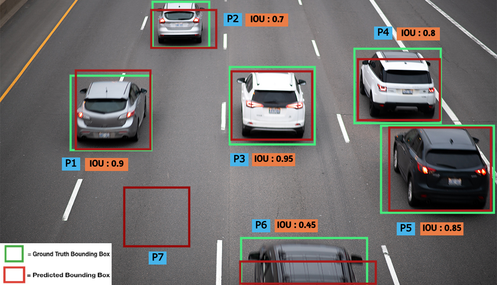

## Visualizing Bounding Boxes and Predictions

The ground-truth bounding boxes and predictive bounding boxes should be visualized, including their locations, categories, Intersection over Union (IoU) scores, and probabilities. An example image with locations and IoUs is shown below. In our specific task, category and probability information should also be included, which is not present in the example image:

## Analysing Classification Errors

To analyze classification errors, various tools can be utilized. For example, a confusion matrix can be employed to determine whether misclassifications primarily occur between specific classes, such as day1 and day3.

## Distribution of Categorical Predictions

The distribution of categorical predictions should be also analyzed. For instance, given that the ground truth label is day3-(0, 0, 1, 0, 0), the incorrect predictions should be examined to determine whether they are evenly distributed-(0.25, 0.2, 0.15, 0.2, 0.2) or highly centralized-(0.9, 0, 0.1, 0, 0, 0).

## Laser Localization Model

This is a PyTorch-based deep learning model for classifying laser images as either green or red based on the color of the laser. The model takes in laser images and predicts the corresponding label.

### Some Important Code Files

1. `mmdetection-master_release/test.py`
   This is a script for testing (and evaluating) a model using the MMDetection library. The script begins by importing necessary packages such as argparse, os, pickle, time, warnings, and others. It then defines a function named parse_args that parses command-line arguments using argparse. The function returns the parsed arguments. The main function calls the parse_args function to get the parsed arguments. It checks that at least one operation is specified (save/eval/format/show the results/save the results) using the argument "--out", "--eval", "--format-only", "--show", or "--show-dir". The function then loads the configuration file specified in the command-line arguments using Config.fromfile from the MMDetection library. It merges any dictionary provided in the argument "--cfg-options" to the configuration. If cudnn_benchmark is set to True in the configuration, torch.backends.cudnn.benchmark is set to True. Finally, the function runs either a single_gpu_test or a multi_gpu_test function depending on the number of GPUs available. If --fuse-conv-bn is set, it applies fuse_conv_bn to the model. The output results are saved in pickle format if --out is specified. If --eval is specified, the evaluation is performed using the specified evaluation metrics. If --format-only is specified, the output results are formatted without performing evaluation. If --show is specified, the output results are shown. If --show-dir is specified, the painted images will be saved in the specified directory.
   
2. `mmdetection-master_release/configs/laser`
   This folder contains the implementation of datasets and some other import configurations.

### Dataset

The laser classification model uses two datasets:

1. The binary classification dataset, which consists of laser images labeled as either green or red.
2. The daytime dataset, which consists of laser images captured during the day and labeled as one of five classes (day1 to day5).

### Training

The model is trained on the binary classification dataset and evaluated on the validation set of the daytime dataset. The training pipeline includes loading the images from file, preprocessing, augmentation, normalization, and converting to PyTorch tensors. The model is trained using the Adam optimizer and the cross-entropy loss function.

### Evaluation

The model is evaluated using the accuracy metric on the validation set of the daytime dataset. The evaluation pipeline includes loading the images from file, preprocessing, normalization, and converting to PyTorch tensors. The accuracy metric is used to evaluate the performance of the model.

## Laser Classification Model

Based on TensorFlow ... TBD

